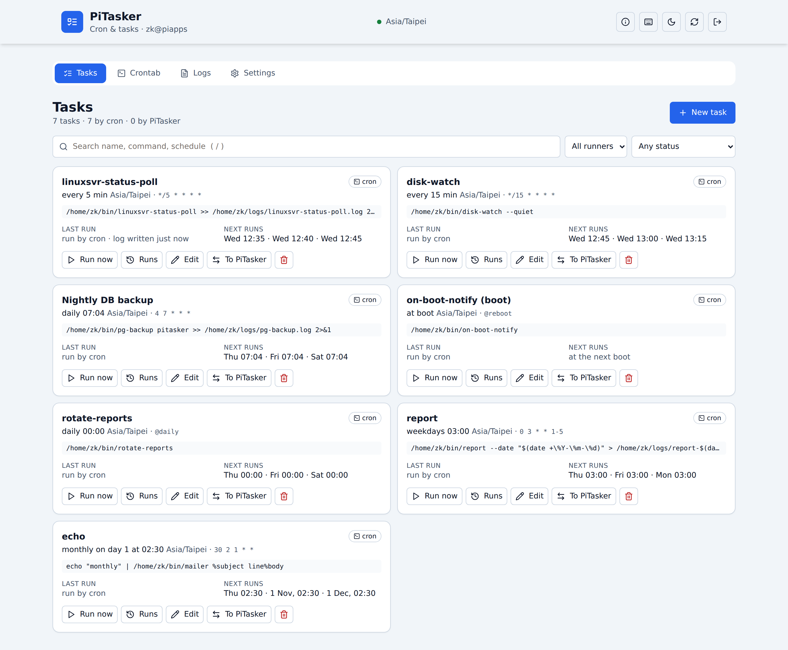

# PiTasker

The cron editor for the HexaWulf homelab: see, edit and run the jobs in a
user's crontab from a web UI, and let PiTasker itself run the jobs that
should not live in cron. Runs on piapps as the pm2 app `pitasker`
(<https://pitasker.piapps.dev>, port 5007 behind nginx + Cloudflare).

**Current version: 2.1.0** — released 2026-10-01: the read-only **Fleet**
view across piapps, piapps2, piapps3, piapps4 and hwca-ap02 (below).
2.0.0 (2026-09-30) was the fix-and-refresh release: one runner
per job, a crontab that stays exactly as you wrote it, a diff before every
write, run history, and the PiDeck 2.0 look. See the [Changelog](CHANGELOG.md)
and the [2.0 plan](docs/plans/2.0.md).



## What's new in 2.0

- **No more double runs**: 1.x ran every imported crontab job a second time
  from its own scheduler (in UTC). Now a job runs from the crontab *or* from
  PiTasker, and the UI says which.
- **Your crontab stays yours**: comments, sections, env and disabled lines
  survive byte-for-byte; writes go through `crontab -` without a shell, with
  a diff first, a backup before and a read-back after.
- **Run history**: exit code, duration, stdout and stderr for every run
  PiTasker starts; last start of cron jobs from their log or the cron journal.
- **Security**: login on every `/api` route (tested), rate-limited login,
  helmet + CSP, CSRF guard, SameSite=Lax cookie; Firebase and 11 npm audit
  findings gone.
- **UI**: the PiDeck 2.0 design language (light/dark, mobile, keyboard
  shortcuts, axe-checked), plain-language schedules with the next runs, and
  an **About** dialog (ⓘ in the header: version, stack, repo and a one-line
  diagnostics string to paste into bug reports).

## Fleet view (2.1)

The **Fleet** tab (`g f`) shows everything scheduled on the homelab, read-only:
each host's zk and root crontab, `/etc/crontab`, `/etc/cron.d/*`,
`cron.{hourly,daily,weekly,monthly}` and systemd timers (system + user), with
plain-language schedules and next runs in **that host's** time zone, the
last run (cron journal, log file or systemd), and hints: *same job on two
hosts*, *script not in bin.git*, *bin replica differs* (from piapps2), *disabled*.
Two views (by host / all jobs), filters and search kept in the URL. Nothing
on the page edits or runs anything; piapps' own crontab links to the Crontab tab.

- The hub (piapps) reads itself in-process. Other hosts run the **PiTasker
  agent**: one file (`dist/agent.mjs`, node built-ins only), as zk, no
  sudo, `GET /api/agent/health` + `GET /api/agent/cron` only, bearer token
  (only its SHA-256 on the agent), bound to the LAN/tunnel address,
  firewalled to the hub. Secrets in commands and env lines are redacted on
  the agent before anything leaves the host.
- Root's crontab comes from a root-owned snapshot unit
  (`/var/lib/pitasker/root-crontab`), not sudo.
- Install on a host: `npm run build:agent` on piapps, copy `dist/agent.mjs`
  **and** `scripts/install-agent.sh` + `deploy/` (the installer renders the
  units from `../deploy/`), then `scripts/install-agent.sh --dry-run --bind <ip> --bundle ~/agent.mjs …`
  (see `--help`; `--update`, `--rollback`, `--uninstall`, `--root-snapshot-only` for the hub).
- Hub settings: `PITASKER_HOSTS`, `PITASKER_HOST_TOKEN_<ID>`,
  `PITASKER_HOST_LABELS`, `PITASKER_HOST_PRODUCTION`, `PITASKER_BIN_MASTER`
  (see `.env.example`). The plan: [docs/plans/2.1-fleet-view.md](docs/plans/2.1-fleet-view.md).

## What it does

- **One runner per task.** A task runs from the **crontab** (PiTasker keeps
  its line in sync) **or** from **PiTasker's scheduler** — never both.
  Moving a task between runners edits the crontab and (un)schedules at once.
  PiTasker's own schedules use the host's time zone.
- **The crontab stays yours.** Comments, section headers, env lines
  (`MAILTO=`, `PATH=`, `TZ=`), blank lines, `@reboot`/`@daily`, `\%`
  escapes and `# DISABLED …` lines are kept byte-for-byte. Importing never
  writes the crontab; an unchanged export writes nothing. PiTasker only adds
  its own `# PITASKER_ID:` / `# PITASKER_COMMENT:` markers above lines it
  changes or adds, and never re-enables a line you commented out.
- **Every crontab write is shown first** as a diff, then sent with the hash
  of what you saw (refused if the crontab changed meanwhile). Before each
  write the old crontab is saved to `~/.local/state/pitasker/crontab-backups/`
  (newest 50), and after it the crontab is read back and compared; on a
  mismatch the old one is restored. Backups can be restored from the UI.
- **Runs PiTasker starts** (scheduled or *Run now*) are recorded: exit code,
  duration, stdout and stderr (tail kept), timeout kills the whole process
  group. The job gets a cron-like environment (no PiTasker secrets).
  For crontab-run jobs PiTasker shows when cron last started them where it
  can tell (the job's log file, or the cron journal with
  `PITASKER_CRON_JOURNAL=on`).
- **Readable schedules**: "every 5 min", "daily 07:04 Asia/Taipei", next
  three runs, an editor with presets, per-field inputs and live validation,
  and a warning when a script is outside `/home/zk/bin` or not committed to
  bin.git (the operator rule).

## Stack

React 18 + Vite + Tailwind (PiDeck 2.0 tokens) · Express 4 · PostgreSQL
(drizzle-orm, migrations in `migrations/`) · node-cron · Node 22.
Memory on piapps: about 115–120 MB RSS steady, ~220 MB briefly at start
(pm2 restarts it above 256 MB).

## Setup

```bash
npm ci
cp .env.example .env        # PORT, DATABASE_URL, SESSION_SECRET (openssl rand -hex 32), …
npm run db:migrate          # creates or upgrades the schema (baselines a 1.x database)
npm run db:seed             # first install only: creates "admin" (random password printed once,
                            # or PITASKER_ADMIN_PASSWORD)
npm run build
pm2 start ecosystem.config.cjs && pm2 save
```

The server refuses to start while migrations are pending. Every setting is
listed in [.env.example](.env.example); new in 2.0: `CSP_ENFORCE`,
`PITASKER_CLOUDFLARE`, `PITASKER_ORIGIN`, `PITASKER_TZ`, `PITASKER_RUN_TIMEOUT_MS`,
`PITASKER_OUTPUT_CAP`, `PITASKER_STATE_DIR`, `PITASKER_CRONTAB_BIN`,
`PITASKER_BIN_DIR`, `PITASKER_CRON_JOURNAL`, `HOST`,
`PITASKER_ADMIN_USER`/`PITASKER_ADMIN_PASSWORD` (seed only). The Firebase
variables are gone.

## Security

Login required for every `/api` route except login itself (a test walks the
router to enforce it). Login and password changes are rate-limited
(10 / 10 min per client; `PITASKER_CLOUDFLARE=1` counts per
CF-Connecting-IP — only when the proxy in front does *not* already restore the
client IP; piapps' nginx does, so it stays off there). Session cookie `pitasker.sid`: Secure, HttpOnly,
SameSite=Lax, new id at login. State-changing requests must be same-origin
JSON. helmet headers and a CSP with hashes of the inline scripts (Report-Only
until `CSP_ENFORCE=true`; violations are logged as `[csp]` lines). New
passwords: at least 12 characters, not the username or the current one;
changing it logs out other sessions.

## Development and tests

```bash
npm run dev                 # tsx server/index.ts (needs a build for the UI, or run vite separately)
npm run check               # tsc
npm run check:theme         # no raw colours outside the --pi-* tokens
npm test                    # vitest; DB suites need PITASKER_TEST_PG_URL (admin URL, creates pitasker_test_*)
npm run test:e2e            # Playwright; needs PITASKER_TEST_PG_URL; serves dist-e2e/ on :5027
                            # (+ fleet agents on :5028/:5029 from fixture hosts)
npm run test:install        # scripts/install-agent.sh with stubs (no root, no real /etc)
npm run check:shell         # shellcheck
npm run build:agent         # dist/agent.mjs (fails if it isn't self-contained)
```

Tests never touch the real crontab or database: a fake `crontab`
(`tests/fakes/crontab`) is first on PATH with `FAKE_CRONTAB_FILE`, and the
crontab code refuses to run under vitest/E2E without it; `server/db.ts`
refuses any database but `pitasker_test_*` / `pitasker_e2e*` in a test run.
The fleet collector likewise refuses the real `systemctl`, `journalctl`,
`timedatectl`, `/etc`, `/home/zk/bin` and `/var/lib/pitasker` in tests: fakes
(`tests/fakes/`) come from `PITASKER_FAKE_BIN_DIR`, fixture hosts from
`tests/fixtures/fleet/` (systemd 255 and 259; Asia/Taipei, Asia/Singapore,
Europe/Berlin, Etc/UTC) with a scratch bin.git each.

## Layout

```
client/src/        React SPA (pages: tasks, crontab, fleet, logs, settings)
server/app.ts      Express app factory (routes, session, CSRF guard, CSP)
server/crontab/    document.ts (line-preserving parser/editor), store.ts (crontab IO,
                   backups, read-back), sync.ts (tasks ⇄ crontab)
server/services/   exec.ts (runs a command), taskRunner.ts, taskScheduler.ts,
                   cronSeen.ts, scriptCheck.ts
server/fleet/      collector.ts (one host's snapshot, read-only), hub.ts (agents, saved
                   snapshots), hints.ts, redact.ts, tools.ts (execFile, test guards)
server/agent/      the agent (node:http) → dist/agent.mjs; deploy/ its systemd units
shared/fleet.ts    the snapshot schema (zod, hub-side); shared/fleet-view.ts view helpers
shared/cron.ts     cron validation, plain-language descriptions, next runs (server + client)
shared/schema.ts   tables and validation
migrations/        drizzle SQL; scripts/migrate*.mjs apply them
docs/plans/2.0.md  the 2.0 plan; docs/archive/ the 1.x notes
```

## Roadmap

From [docs/plans/2.0.md](docs/plans/2.0.md), after 2.0:

- **P3 — fleet view (read-only)**: released in 2.1.0 (above).
- **P4 — fleet editing**: edit the zk crontab on piapps2, piapps3, piapps4
  and hwca-ap02 through a small, separate PiTasker agent (own token,
  LAN/WireGuard only, diff + backup + audit for every write). Root crontabs
  and `/etc/cron.d` stay read-only until a later opt-in.

## License

MIT — see [LICENSE](LICENSE).
